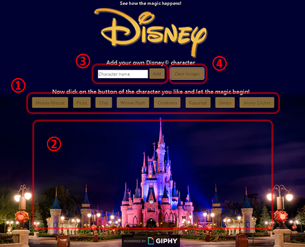

#Giphy
> Cretaed by:     Juan I Diaz (jdi@idiaz.ca)
> Date:           December 2018

## DESCRIPTION: A dynamic web page that populates gifs of your choice using the GIPHY API. This project uses API calls to GIPHY and modifies the DOM using JavaScript and jQuery

## INSTRUCTIONS:

1. Click on any of the preloaded characters to retreive images.
2. 10 images will be display un the area beneath the buttons. Move your mouse over the image to make them move.
3. Add your favorite character and repeat steps 1-2.
4. Clear the images (not the buttons)

## QUESTIONS OR COMMENTS
- Feel free to contact the developer!